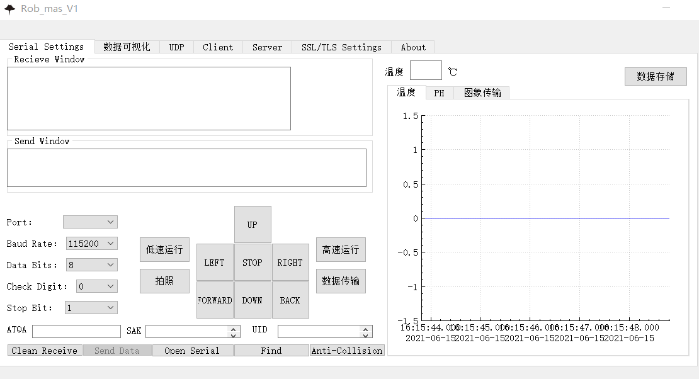
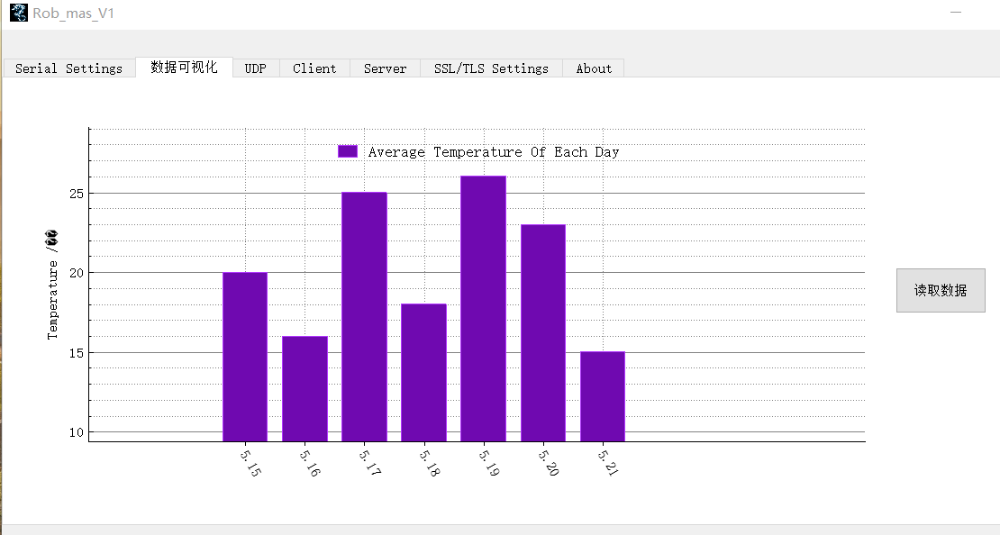

Rob_mas
====

背景
-------
国家级大学生创新创业训练计划机器人上位机代码，项目基于QT，并在STM32上进行测试

功能
-------
目前可以通过串口传输实现向下位机发送控制协议与接受下位机回传的传感器数据协议，并进行可视化展示与存储

    
	

Contact
-------
如果您有任何问题请联系我（403500543@qq.com）
[我的博客](http://vampon.club "VAM")
